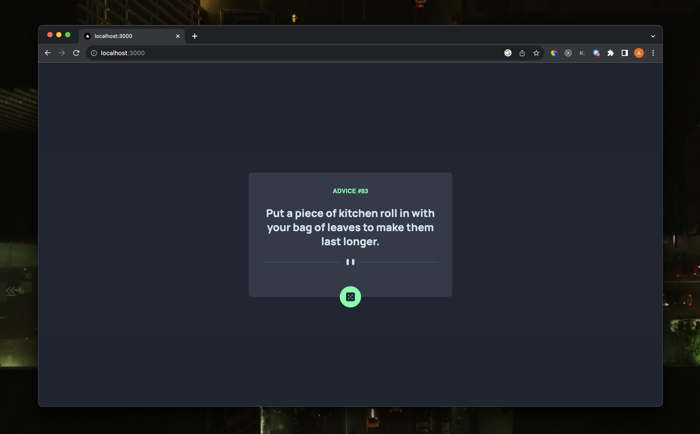
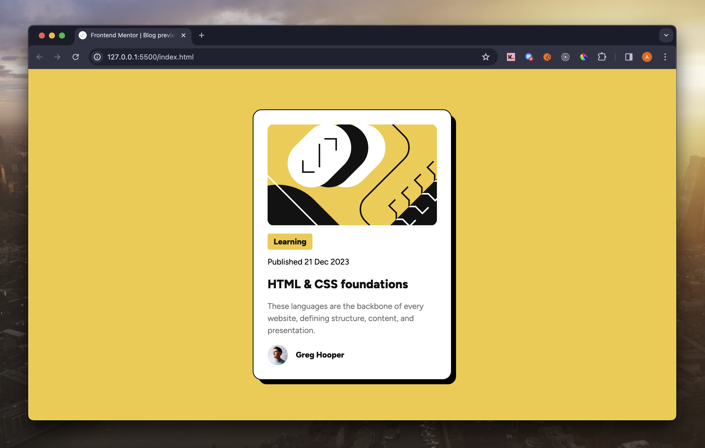
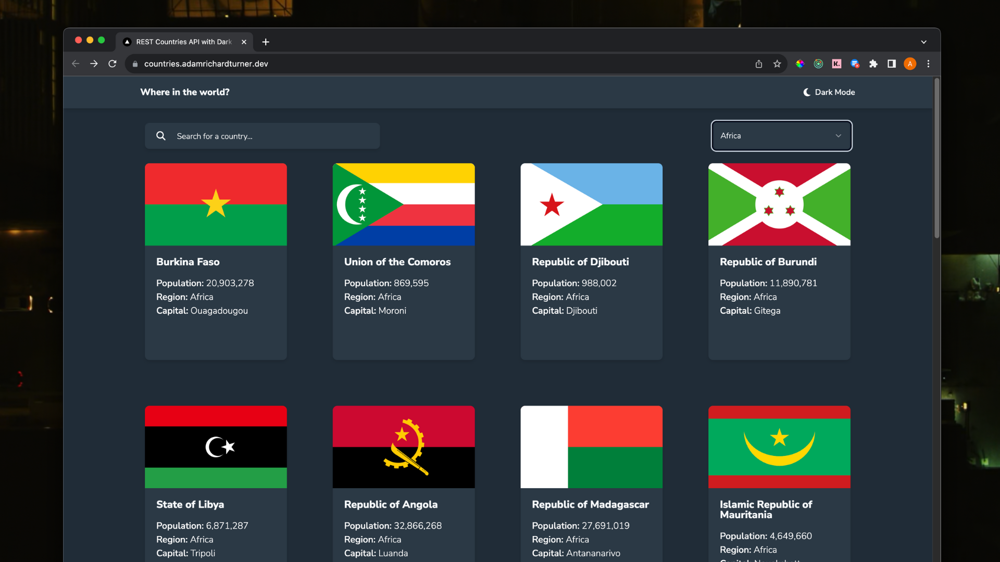
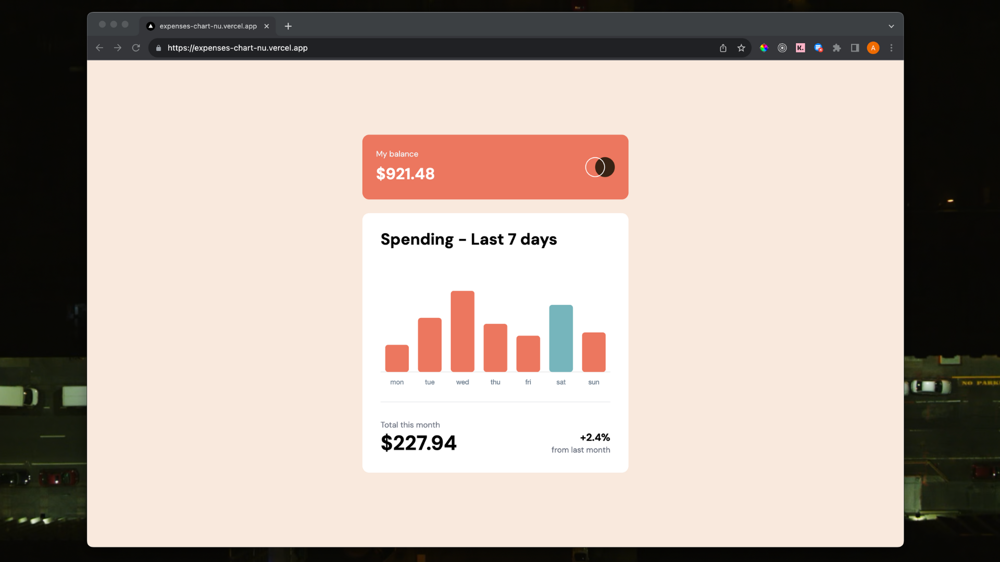
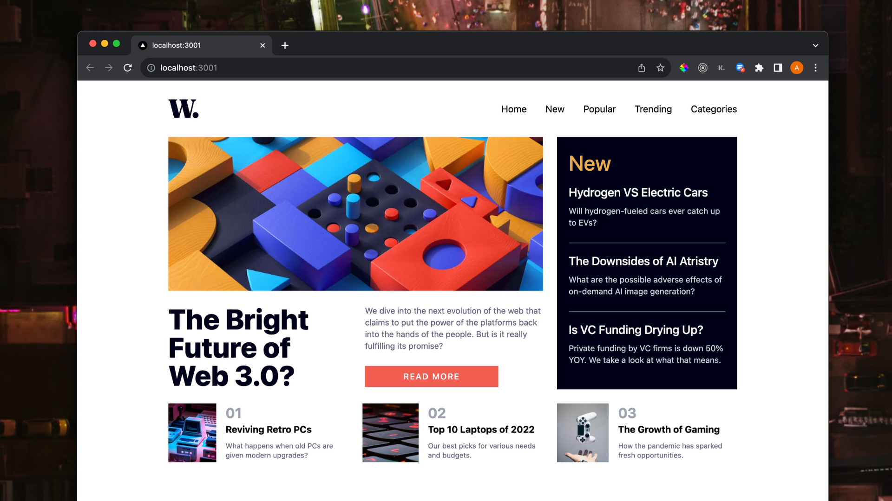
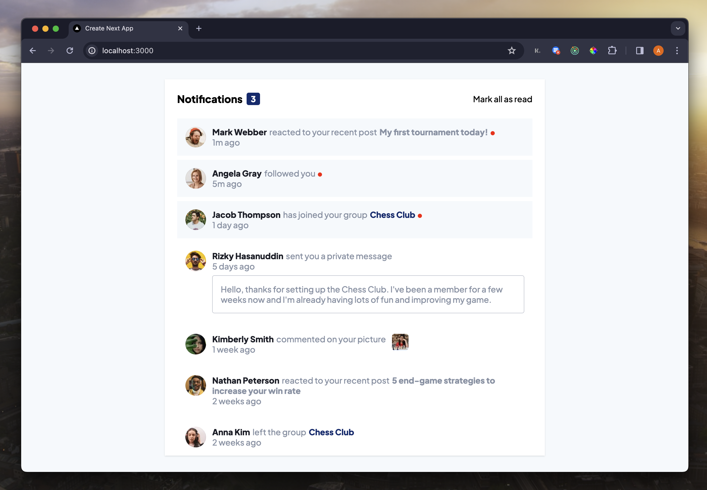
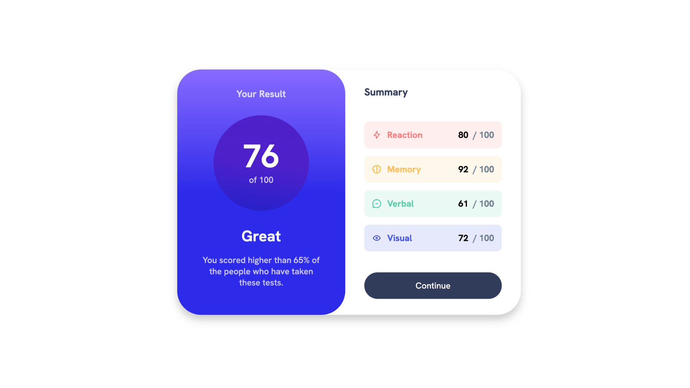

## 🎨 Frontend Mentor Challenge Solutions 🎨

This is a collection of my solutions to the challenges of the Frontend Mentor program.

Each project showcases a variety of skills and technologies used in modern software development.

Below are a list of these projects with links to the live sites, code repositories, and the original challenge descriptions.

## 📚 Project List

 

<!-- Advice Generator -->
<table align="center"><tr><td>
  <picture>
    
  </picture>
     
  <h2 align="center">Advice Generator</h2>
  <h3 align="center"> 
    
  </h3>
  

    <a href="https://advice.adamrichardturner.dev">Live</a> | <a href="https://github.com/adamrichardturner/advice-generator">Repo</a> | <a href="#">Try Out</a>
  

    
</td></tr></table>

<!-- Blog Preview Card -->
<table align="center"><tr><td>
  <picture>
    
  </picture>
     
  <h2 align="center">Blog Preview Card</h2>
  <h3 align="center"> 
    
  </h3>
  

    <a href="https://blogcard.adamrichardturner.dev">Live</a> | <a href="https://github.com/adamrichardturner/blog-preview-card">Repo</a> | <a href="#">Try Out</a>
  

    
</td></tr></table>

<!-- Countries -->
<table align="center"><tr><td>
  <picture>
    
  </picture>
     
  <h2 align="center">Countries</h2>
  <h3 align="center"> 
    
  </h3>
  

    <a href="https://countries.adamrichardturner.dev">Live</a> | <a href="https://github.com/adamrichardturner/countries">Repo</a> | <a href="#">Try Out</a>
  

    
</td></tr></table>

<!-- Expenses Chart -->
<table align="center"><tr><td>
  <picture>
    
  </picture>
     
  <h2 align="center">Expenses Chart</h2>
  <h3 align="center"> 
    
  </h3>
  

    <a href="https://expenses.adamrichardturner.dev">Live</a> | <a href="https://github.com/adamrichardturner/expenses-chart">Repo</a> | <a href="#">Try Out</a>
  

    
</td></tr></table>

<!-- Continue with other projects in the same format... -->

<!-- News Homepage -->
<table align="center"><tr><td>
  <picture>
    
  </picture>
     
  <h2 align="center">News Homepage</h2>
  <h3 align="center"> 
    
  </h3>
  

    <a href="https://news.adamrichardturner.dev">Live</a> | <a href="https://github.com/adamrichardturner/news-homepage">Repo</a> | <a href="#">Try Out</a>
  

    
</td></tr></table>

<!-- Newsletter Sign-Up -->
<table align="center"><tr><td>
  <picture>
    
  </picture>
     
  <h2 align="center">Newsletter Sign-Up</h2>
  <h3 align="center"> 
    
  </h3>
  

    <a href="https://newsletter.adamrichardturner.dev">Live</a> | <a href="https://github.com/adamrichardturner/newsletter-sign-up">Repo</a> | <a href="#">Try Out</a>
  

    
</td></tr></table>

<!-- Notifications Page -->
<table align="center"><tr><td>
  <picture>
    
  </picture>
     
  <h2 align="center">Notifications Page</h2>
  <h3 align="center"> 
    
  </h3>
  

    <a href="https://notifications.adamrichardturner.dev">Live</a> | <a href="https://github.com/adamrichardturner/notifications-page">Repo</a> | <a href="#">Try Out</a>
  

    
</td></tr></table>

<!-- Results Summary Component -->
<table align="center"><tr><td>
  <picture>
    
  </picture>
     
  <h2 align="center">Results Summary Component</h2>
  <h3 align="center"> 
    
  </h3>
  

    <a href="https://summary.adamrichardturner.dev">Live</a> | <a href="https://github.com/adamrichardturner/results-summary-component">Repo</a> | <a href="#">Try Out</a>
  

    
</td></tr></table>
